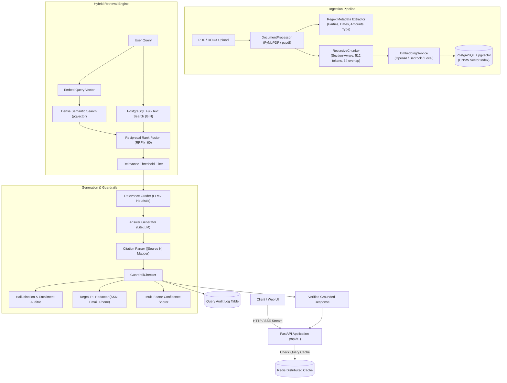
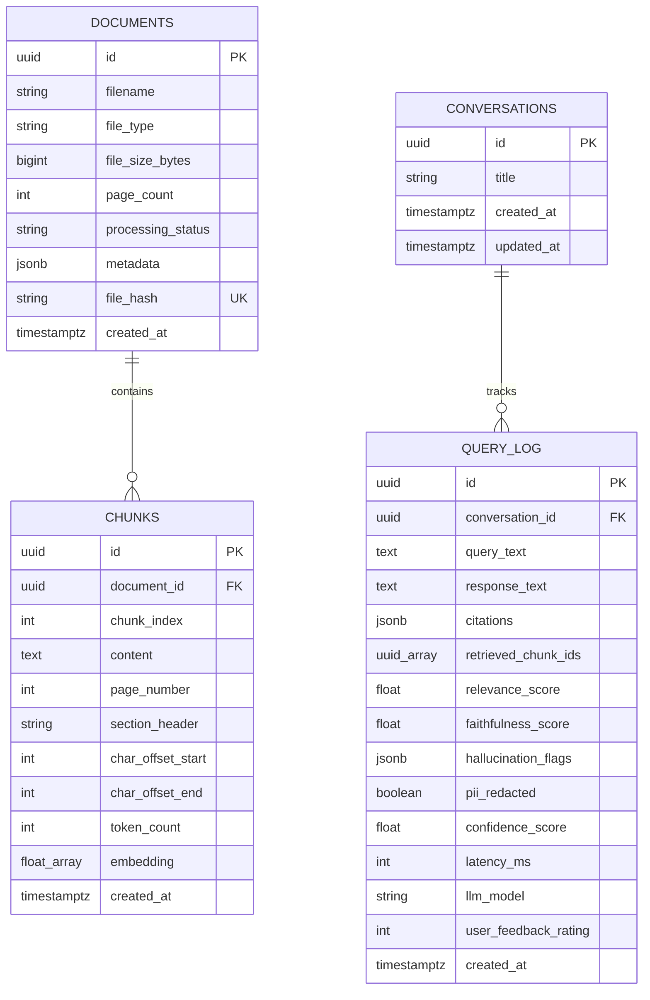

# Termnova System Architecture & Engineering Design

> **Beta AI Contract Intelligence Platform — Current Implemented Architecture**
> Engineered by **Aditya Malkar**

---

## 1. System Overview

**Termnova** is a contract-focused Retrieval-Augmented Generation (RAG) platform designed to parse, index, search, and analyze agreements. It is a beta system: generated answers and extracted facts require review against the linked source text, and enterprise identity and tenant-isolation controls remain roadmap work.

Traditional naive single-pass RAG pipelines frequently suffer from:
1. **Low Keyword Recall:** Dense embedding search misses exact clause numbers (`ARTICLE 6.1`), currency thresholds (`$2,500,000`), and specific identifiers.
2. **Context Pollution:** Irrelevant or tangential document chunks are passed to the generator LLM, causing hallucinations or diluted answers.
3. **Lack of Verifiable Grounding:** Generic chatbots generate prose without citing exact source pages, paragraphs, or section headings.
4. **Privacy Vulnerabilities:** Sensitive Personally Identifiable Information (SSNs, emails, phone numbers) leaking in generation outputs.

Termnova solves these challenges through an integrated 5-stage architecture:
- **Structure-Aware Document Ingestion:** Extracts pages, preserves section boundaries, and tracks exact character offsets.
- **Hybrid Retrieval (Dense + Sparse with RRF):** Fuses pgvector cosine similarity with indexed PostgreSQL full-text ranking via Reciprocal Rank Fusion.
- **Relevance Grading:** Filters out low-relevance candidates before generation.
- **Citation-Grounded Answer Generation:** Generates responses with `[Source N]` attribution tags linking to document, page, and chunk.
- **Responsible AI Guardrails:** Automated claim-level entailment auditing, PII scrubbing, and multi-factor confidence scoring.

---

## 2. End-to-End System Architecture

---

## 3. Detailed Component Architecture

### 3.1 Structure-Aware Document Pipeline
- **File Parsing:** Uses `pypdf` and `PyMuPDF` to read raw page text while maintaining 1-based page numbers.
- **Section Heuristics:** Matches headings (`ARTICLE`, `SECTION`, `CLAUSE`, uppercase titles) and attaches them to corresponding page text.
- **Metadata Extraction:** Pre-extracts contracting parties, currency amounts, dates, and agreement types via compiled regular expressions.
- **Recursive Chunking:** Splits on structural separators `["\n\n", "\n", ". ", "; ", ", "]` ensuring chunks do not split across sections where possible. Each chunk is tagged with `page_number`, `section_header`, `char_offset_start`, `char_offset_end`, and `token_count`.

### 3.2 Hybrid Retrieval with Reciprocal Rank Fusion (RRF)
To achieve high recall across both conceptual legal queries and exact terminology:

1. **Semantic Vector Search:** Computes dense cosine similarity between query embedding and chunk vectors stored in PostgreSQL:
   $$\text{Sim}_{\text{dense}}(q, d) = \frac{\vec{q} \cdot \vec{d}}{\|\vec{q}\| \|\vec{d}\|}$$
2. **PostgreSQL Full-Text Search:** Uses an English `tsvector`, a GIN index, `websearch_to_tsquery`, and `ts_rank_cd` without rebuilding an application-memory corpus.
3. **Reciprocal Rank Fusion (RRF):** Merges both ranked lists using rank reciprocal smoothing ($k = 60$):
   $$\text{Score}_{\text{RRF}}(d) = \frac{w_{\text{dense}}}{60 + r_{\text{dense}}(d)} + \frac{w_{\text{sparse}}}{60 + r_{\text{sparse}}(d)}$$
   where $w_{\text{dense}} = 0.60$ and $w_{\text{sparse}} = 0.40$.

### 3.3 Relevance Grading & Generation
- **Context Grader:** Evaluates candidate chunks for relevance to the user question, filtering out non-relevant noise before prompting the generator.
- **Citation Enforcement:** System prompt strictly instructs the LLM to assert only verified facts and attach `[Source N]` tags. The generator parses these tags and maps them to the underlying chunk metadata.

### 3.4 Responsible AI Guardrails
- **Entailment Claim Auditing:** Deconstructs the generated answer into individual propositional sentences and evaluates token overlap / semantic entailment against retrieved context chunks.
- **Faithfulness Scoring:**
  $$\text{Faithfulness} = \frac{\text{Count of Supported Claims}}{\text{Total Factual Claims}}$$
- **PII Scrubbing:** Redacts Social Security Numbers, corporate emails, telephone numbers, and credit card numbers before client delivery.
- **Composite Confidence Scoring:**
  $$\text{Confidence} = 0.30 \cdot \overline{\text{Score}}_{\text{retrieval}} + 0.30 \cdot \overline{\text{Score}}_{\text{relevance}} + 0.40 \cdot \text{Faithfulness}$$

---

## 4. Database Schema (Entity-Relationship Diagram)

---

## 5. Caching & Performance Architecture

- **Redis Query Deduplication:** Hashes incoming query strings and stores high-confidence responses with a 300-second TTL.
- **Database-Maintained Lexical Index:** PostgreSQL updates each chunk's `tsvector`; no process-local corpus cache is required.
- **Asynchronous Execution:** All database transactions and external model calls use `asyncio` and `asyncpg` connection pools.
